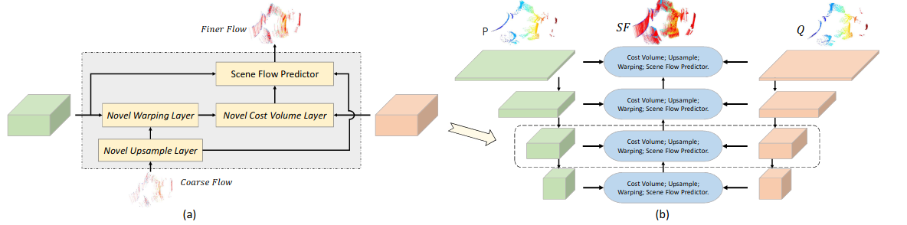
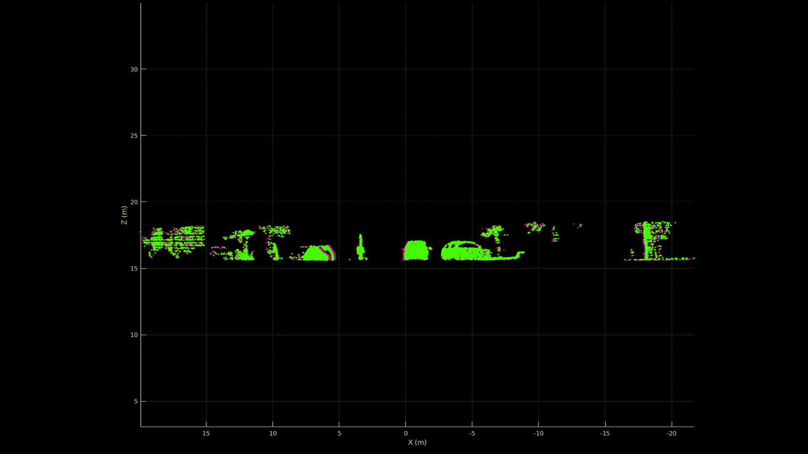

# PointPWC-Net: *Cost Volume on Point Clouds for (Self-) Supervised Scene Flow Estimation*
This is the code for [PointPWC-Net](https://arxiv.org/abs/1911.12408), a deep coarse-to-fine network designed for 3D scene flow estimation from 3D point clouds. Created by <a href="http://web.engr.oregonstate.edu/~wuwen/" target="_blank">Wenxuan Wu</a>, <a href="http://web.engr.oregonstate.edu/~lif/" target="_blank">Fuxin Li</a> from Oregon State University.



**Update:**

* Self-supervised loss is release in model.py(multiScaleChamferSmoothCurvature).
You can train the self-supervised model by using train_self.py.
* Update PointConvFlow to compute the patch-to-patch cost volume.
* Update a updated model pretrain weight to obtain a better result(*<strong>EPE3D: 0.0463 vs 0.0588</strong>*) than the original paper.

## Citation

If you find our work useful in your research, please consider citing:

```
@inproceedings{wu2020pointpwc,
  title={PointPWC-Net: Cost Volume on Point Clouds for (Self-) Supervised Scene Flow Estimation},
  author={Wu, Wenxuan and Wang, Zhi Yuan and Li, Zhuwen and Liu, Wei and Fuxin, Li},
  booktitle={European Conference on Computer Vision},
  pages={88--107},
  year={2020},
  organization={Springer}
}
```

```
@article{wu2019pointpwc,
  title={PointPWC-Net: A Coarse-to-Fine Network for Supervised and Self-Supervised Scene Flow Estimation on 3D Point Clouds},
  author={Wu, Wenxuan and Wang, Zhiyuan and Li, Zhuwen and Liu, Wei and Fuxin, Li},
  journal={arXiv preprint arXiv:1911.12408},
  year={2019}
}
```

## Prerequisities
Our model is trained and tested under:
* Python 3.6.9
* NVIDIA GPU + CUDA CuDNN
* PyTorch (torch == 1.5)
* scipy
* tqdm
* sklearn
* numba
* cffi
* pypng
* pptk

Compile the furthest point sampling, grouping and gathering operation for PyTorch. We use the operation from this [repo](https://github.com/sshaoshuai/Pointnet2.PyTorch).

```shell
cd pointnet2
python setup.py install
cd ../
```

## Data preprocess

For fair comparison with previous methods, we adopt the preprocessing steps in [HPLFlowNet](https://web.cs.ucdavis.edu/~yjlee/projects/cvpr2019-HPLFlowNet.pdf). Please refer to [repo](https://github.com/laoreja/HPLFlowNet). We also copy the preprocessing instructions here for your reference.

* FlyingThings3D:
Download and unzip the "Disparity", "Disparity Occlusions", "Disparity change", "Optical flow", "Flow Occlusions" for DispNet/FlowNet2.0 dataset subsets from the [FlyingThings3D website](https://lmb.informatik.uni-freiburg.de/resources/datasets/SceneFlowDatasets.en.html) (we used the paths from [this file](https://lmb.informatik.uni-freiburg.de/data/FlyingThings3D_subset/FlyingThings3D_subset_all_download_paths.txt), now they added torrent downloads)
. They will be upzipped into the same directory, `RAW_DATA_PATH`. Then run the following script for 3D reconstruction:

```bash
python3 data_preprocess/process_flyingthings3d_subset.py --raw_data_path RAW_DATA_PATH --save_path SAVE_PATH/FlyingThings3D_subset_processed_35m --only_save_near_pts
```

* KITTI Scene Flow 2015
Download and unzip [KITTI Scene Flow Evaluation 2015](http://www.cvlibs.net/download.php?file=data_scene_flow.zip) to directory `RAW_DATA_PATH`.
Run the following script for 3D reconstruction:

```bash
python3 data_preprocess/process_kitti.py RAW_DATA_PATH SAVE_PATH/KITTI_processed_occ_final
```

## Get started

Here are some demo results:

 

### Train
Set `data_root` in the configuration file to `SAVE_PATH` in the data preprocess section. Then run
```bash
python3 train.py config_train.yaml
```
After training the model with a quater dataset, one can achieve a better results as the paper by finetuning the model with the full dataset using the following command. Before running the finetuning the model, one need to set the `pretrain` to the pretrained weights. An example path is shown in the `config_train_finetune.yaml`.
```bash
python3 train.py config_train_finetune.yaml
```

One can train the model using the similar commend as before for self-supervised model by replacing the `train.py` to `train_self.py`.

### Evaluate
Set `data_root` in the configuration file to `SAVE_PATH` in the data preprocess section. Then run
```bash
python3 evaluate.py config_evaluate.yaml
```

We upload one pretrained model in ```pretrain_weights```.


## Acknowledgement

We thank [repo](https://github.com/sshaoshuai/Pointnet2.PyTorch) and [repo](https://github.com/laoreja/HPLFlowNet) for subsampling, grouping and data preprocessing related functions.


